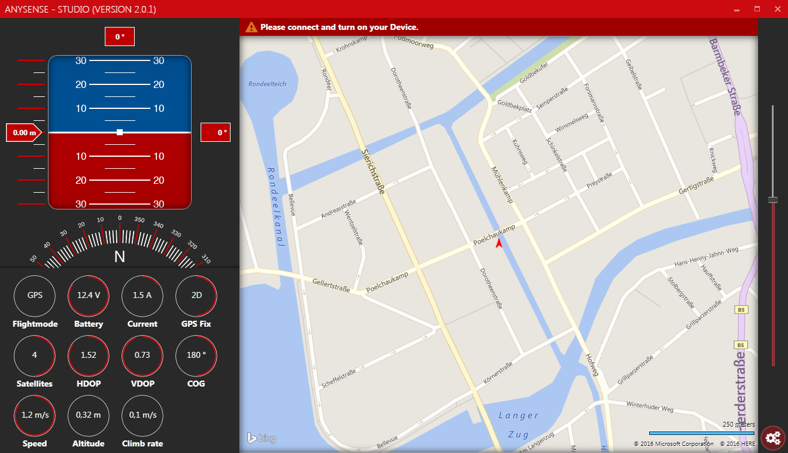
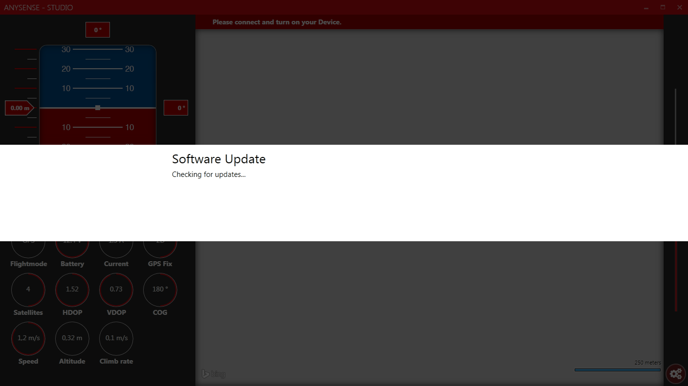

# AnySense Pro
The AnySense Pro (aka 2.0) is an onboard flight logger and real-time telemetry system for (mainly) multicopters with versatile interfacing to various flight controllers, sensors and telemetry protocols. It is a further development of the [AnySense](https://github.com/cemizm/AnySense) and provides a more powerfull MCU (STM32F3) an SD-Card interface and USB connectivity for configuration and updates. A detailed description of the AnySense Pro can be found in the [manual](Dokumentation/AnySense_Pro_EN_.pdf) and 

## Features
The aim of the AnySense Pro is to build a bridge between multiple proprietary systems and protocols in order to reduce the total take-off weight of the flight object. This is achived by reusing any existing sensor (source) of the integrated flight controller in a multicopter, and feeding the telemetry data to various sinks like the onboard SD-Card or real-time telemetrie return channel. 
 
 

### Flight Controller (source)
The AnySense Pro supports a wide range of open source and commercial flight controllers. A full list of provided sensors of each flight controller can be found in the [Manual](Dokumentation/AnySense_Pro_EN_.pdf). The flight controller connector provides 5V power supply, a CAN-Bus interface and full-duplex uart interface. 

| | |
|:---------:|:-----------:|
|  |  |

* [DJI Naza-M V1 / Lite](https://www.dji.com/de/naza-m-lite/feature)
* [DJI Naza-M V2](https://www.dji.com/de/naza-m-v2)
* [DJI Wookong](https://www.dji.com/de/wookong-m)
* [DJI A2](https://www.dji.com/de/a2)
* [DJI Phantom 2](https://www.dji.com/de/phantom-2)
* [3DR Pixhawk](https://docs.px4.io/master/en/flight_controller/mro_pixhawk.html)
* [Tarot ZYX-M](http://www.tarotrc.com/Product/Detail.aspx?Lang=en&Id=65341cc3-7941-4a12-84ea-8abc58bd59e7)
* [Align MRS](https://www.align.com.tw/index.php/download-en/mrs/)

Depending on the flight control, a corresponding cable with connectors and pin assignment is required. The pin assignment defines which hardware interface is used. The pinout of the flight controller connector on the AnySense Pro can be found in the [Schematics](Hardware/Pro/AnySensePro.pdf) or in some [example cables](Hardware/Kabel/CANBusKabel.pdf).

### FrSky Sensor (source)
Additionally to the integrated sensor of the flight controller, it is possible to use sensor of the vendor FrSky to obtain further telemetry data like a current sensor to measure total current consumption or a cell voltage sensor to monitor individual cells of the battery pack. The full list of supported sensors and implementation details can be found in the [source code](Firmware/shared/Application/source/SensorFrSky.cpp).

| | |
|:---------:|:-----------:|
|  |  |

The FrSky sensors run as a bus system and can therefore be daisy-chained together. for this purpose, each sensor offers two interconnected ports. The AnySense Pro acts as the master and each sensor operates as a slave. 

### USB
The USB interface of the AnySense Pro is used for configuration and firmware updates. The AnySense Pro implements an [USB-CDC device](Firmware/shared/Middleware/USB/source/USBCDCDevice.cpp) for serial communication with the host. The [host driver](Firmware/shared/driver/AnySensePro.inf) for the AnySense Pro uses [Microsoft provided in-box driver](https://docs.microsoft.com/en-us/windows-hardware/drivers/usbcon/usb-driver-installation-based-on-compatible-ids) with custom vendor and product ids. The AnySense Studio is a .NET WPF Application and can be used for configuration and firmware updates.
| | |
|:---------:|:-----------:|
|  |  |

### Micro SD (sink)

### Telemetry (sink)

### MAVLink OSD (sink)

## Project / Repository structure 

### Hardware
### Firmware
### GroundTools
### Dokumnetation
